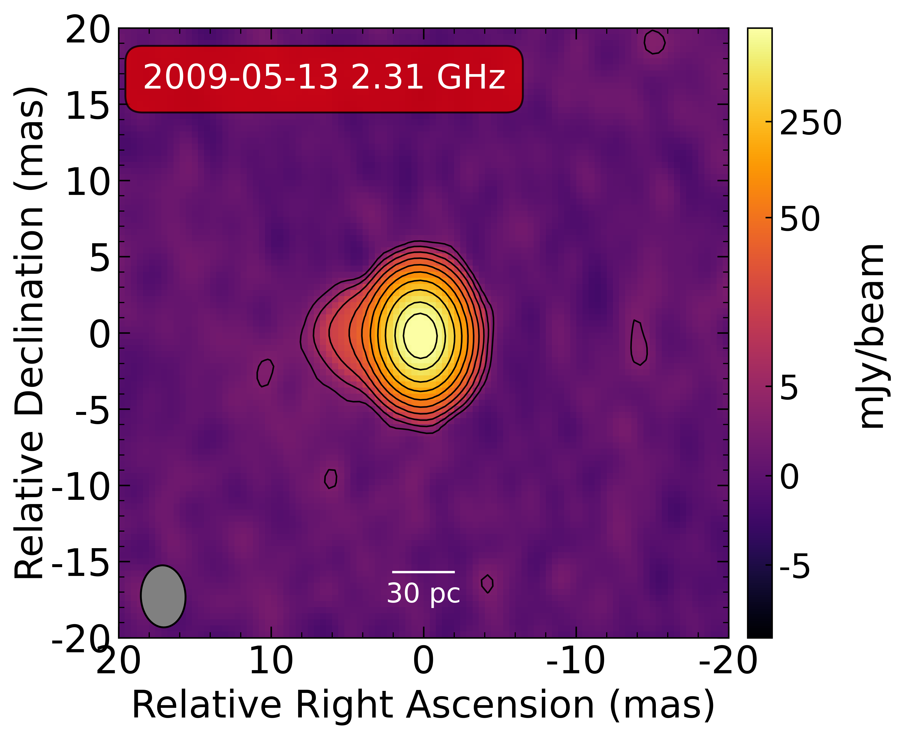

Plot VLBI images
################################

This is a python package to plot VLBI images. 
It can plot the images from Difmap, AIPS, and FITS files.

Usage
===============

First change to the directory of the FITS file, then run the following command,
it will generate the plot of the image in output directory.

.. code:: bash

    $ cd /the/path/of/fits/file
    $ mkdir output
    $ python3 plot_VLBI_images.py filename z rms k pc
    # for example
    $ python3 plot_VLBI_images.py J0646-20090513S-cln.fits 3.396 1.5 20 30

The output image looks like the following image.

.. note:: 
    
    In general, we will using k = 40 for L band, k = 20 for S band, k = 5 for U and X band.
    You can change the value of k according to the image quality.

The following is the example of the usage of the package, which was published in the paper of "The first VLBI image of a supernova remnant in M82".

.. code:: bash

    $ python3 plot_VLBI_images.py J0646+20100521L-cln.fits 3.396 1.5 40 50
    $ python3 plot_VLBI_images.py J0646-20090513S-cln.fits 3.396 1.5 20 30
    $ python3 plot_VLBI_images.py J0646-20090513X-cln.fits 3.396 1.5 5 10
    $ python3 plot_VLBI_images.py J0646-20090528U-cln.fits 3.396 1.5 5 10

Using slurm
================

If you want to use slurm to run the code, you can use the following command.

.. code:: bash

    $ srun --comment=hetu_ai -N 1 -p insp-128C4T bash go.sh

The content of go.sh is same with the previous command.